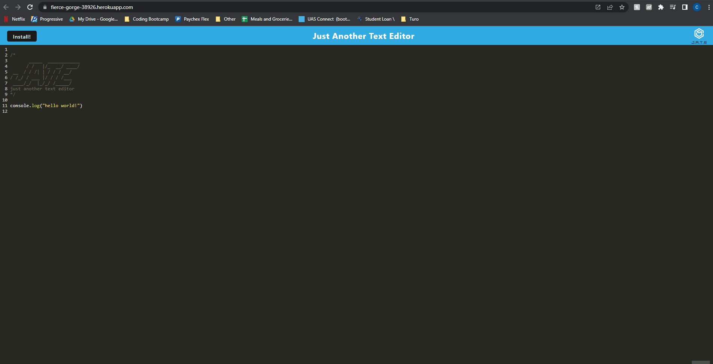

# PWA-Text-Editor

## Description

This is a Progressive Web Application text editor that runs in the browser. It is a single-page application that features data persistence techniques to serve as a redundancy in case an option is not supported by the browser. This application also functions offline! When you click on the "Install!" button, the web application is downloaded as in icon to your desktop.

## Table of Contents

- [Installation](#installation)
- [Usage](#usage)
- [Contributing](#contributing)
- [Questions](#questions)
- [License](#license)

## Installation

To visit the heroku application, follow the link in the [Usage](#usage) section to view and interact with the app.

If you wish to clone this repository, open a terminal at the root of your cloned folder and run "npm i" followed by "npm run start".

## Usage

[Link to the PWA-Text-Editor repository](https://github.com/cdfoye/PWA-Text-Editor)

[Link to the PWA-Text-Editor Heroku application](https://fierce-gorge-38926.herokuapp.com/)

The gif below is a mock-up of the application functionality:

## Contributing

If you would like to contribute to this project please reach out to me on Github or by email.

## Questions

If you have any questions please visit my Github profile: [cdfoye](https://github.com/cdfoye)

For additional questions you can email me at cdfoye@gmail.com

## License

This application is covered under the MIT license
